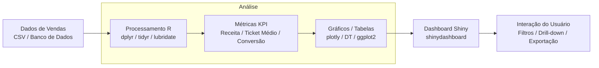
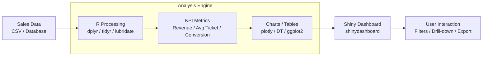

# 🇧🇷 Dashboard de Vendas E-commerce | 🇺🇸 E-commerce Sales Dashboard

<div align="center">


[](Dockerfile)


**Dashboard interativo profissional para análise completa de dados de vendas e-commerce**

[🚀 Demo](#-demonstração) • [📖 Documentação](#-documentação) • [⚡ Instalação](#-instalação-rápida) • [🤝 Contribuir](#-contribuição)

</div>

---

## 🇧🇷 Português

### 📊 Visão Geral

Este projeto apresenta um **dashboard interativo completo** desenvolvido em R e Shiny para análise abrangente de dados de vendas de e-commerce. A aplicação demonstra competências avançadas em:

- 📈 **Análise de Dados**: Processamento e análise de grandes volumes de dados de vendas
- 🎨 **Visualização Interativa**: Gráficos dinâmicos e responsivos com plotly
- 🌐 **Desenvolvimento Web**: Interface moderna e intuitiva com Shiny
- 📊 **Business Intelligence**: KPIs, métricas e insights de negócio
- 🔄 **Processamento de Dados**: ETL e transformação de dados em tempo real

### Fluxo da Aplicação



### 🎯 Objetivos do Projeto

- **Demonstrar competências técnicas** em R, Shiny e análise de dados
- **Criar uma ferramenta prática** para análise de vendas e-commerce
- **Implementar boas práticas** de desenvolvimento e documentação
- **Fornecer insights acionáveis** para tomada de decisão empresarial

### 🛠️ Stack Tecnológico

#### Core Technologies
- **R 4.1+**: Linguagem principal para análise estatística
- **Shiny**: Framework para aplicações web interativas
- **shinydashboard**: Interface de dashboard profissional

#### Visualização e UI/UX
- **plotly**: Gráficos interativos e responsivos
- **DT**: Tabelas interativas com funcionalidades avançadas
- **shinycssloaders**: Indicadores de carregamento
- **shinyWidgets**: Componentes UI modernos

#### Manipulação de Dados
- **dplyr**: Manipulação eficiente de dados
- **tidyr**: Organização e limpeza de dados
- **lubridate**: Manipulação de datas e períodos
- **scales**: Formatação de números e escalas

#### Análise Estatística
- **ggplot2**: Visualizações estáticas de alta qualidade
- **forecast**: Análise de séries temporais
- **corrplot**: Matrizes de correlação

### 📋 Pré-requisitos

#### Requisitos do Sistema
- **R**: Versão 4.1.0 ou superior
- **RStudio**: Recomendado para desenvolvimento
- **Navegador**: Chrome, Firefox, Safari ou Edge (versões recentes)
- **Memória RAM**: Mínimo 4GB, recomendado 8GB+

#### Instalação de Dependências

```r
# Instalar pacotes principais
install.packages(c(
  "shiny", "shinydashboard", "shinyWidgets", "shinycssloaders",
  "DT", "plotly", "dplyr", "tidyr", "ggplot2", 
  "lubridate", "scales", "corrplot", "forecast"
))

# Verificar instalação
library(shiny)
packageVersion("shiny")
```

### 🚀 Instalação Rápida

#### Método 1: Clone Direto
```bash
# Clone o repositório
git clone https://github.com/galafis/r-sales-dashboard-shiny.git

# Navegue para o diretório
cd r-sales-dashboard-shiny

# Abra no RStudio ou execute via R
```

#### Método 2: Download ZIP
1. Baixe o arquivo ZIP do repositório
2. Extraia para um diretório local
3. Abra o arquivo `app.R` no RStudio

#### Método 3: Execução Direta
```r
# Execute diretamente do GitHub
shiny::runGitHub("r-sales-dashboard-shiny", "galafis")
```

### 🎮 Como Usar

#### Execução Local
```r
# Método 1: Via RStudio
# 1. Abra o arquivo app.R
# 2. Clique em "Run App"

# Método 2: Via console R
setwd("caminho/para/r-sales-dashboard-shiny")
shiny::runApp()

# Método 3: Com configurações específicas
shiny::runApp(port = 3838, host = "0.0.0.0")
```

#### Acesso à Aplicação
- **URL Local**: http://localhost:3838
- **Interface**: Dashboard responsivo e intuitivo
- **Dados**: Carregamento automático de dados simulados

### 📁 Estrutura Detalhada do Projeto

```
r-sales-dashboard-shiny/
├── 📄 app.R                    # Aplicação Shiny principal
├── 📁 data/                    # Dados e scripts de geração
│   ├── 📄 generate_data.R      # Script para gerar dados simulados
│   ├── 📄 sales_data.csv       # Dataset principal (gerado)
│   └── 📄 data_dictionary.md   # Dicionário de dados
├── 📁 R/                       # Módulos R organizados
│   ├── 📄 ui_modules.R         # Módulos de interface
│   ├── 📄 server_modules.R     # Módulos de servidor
│   ├── 📄 data_processing.R    # Funções de processamento
│   └── 📄 plotting_functions.R # Funções de visualização
├── 📁 www/                     # Recursos web estáticos
│   ├── 📄 style.css           # Estilos customizados
│   ├── 📄 custom.js           # JavaScript customizado
│   └── 📁 images/             # Imagens e ícones
├── 📁 docs/                    # Documentação adicional
│   ├── 📄 user_guide.md       # Guia do usuário
│   ├── 📄 technical_specs.md  # Especificações técnicas
│   └── 📄 deployment.md       # Guia de deployment
├── 📄 README.md               # Este arquivo
├── 📄 LICENSE                 # Licença MIT
├── 📄 .gitignore             # Arquivos ignorados
├── 📄 renv.lock              # Controle de dependências
└── 📄 Dockerfile             # Container Docker
```

### 🎨 Funcionalidades Principais

#### 🏠 Dashboard Principal
- **KPIs Dinâmicos**: Vendas totais, ticket médio, conversão
- **Gráficos Interativos**: Zoom, hover, filtros em tempo real
- **Métricas de Performance**: Comparações período a período
- **Alertas Inteligentes**: Identificação de anomalias

#### 📊 Análise Temporal
- **Séries Temporais**: Vendas por dia, semana, mês, trimestre
- **Sazonalidade**: Identificação de padrões sazonais
- **Tendências**: Análise de crescimento e declínio
- **Previsões**: Projeções baseadas em dados históricos

#### 🛍️ Análise de Produtos
- **Performance por Categoria**: Ranking de categorias mais vendidas
- **Análise ABC**: Classificação de produtos por importância
- **Margem de Lucro**: Análise de rentabilidade por produto
- **Ciclo de Vida**: Produtos em crescimento, maturidade e declínio

#### 🗺️ Análise Geográfica
- **Vendas por Região**: Distribuição geográfica das vendas
- **Mapas Interativos**: Visualização em mapas com drill-down
- **Performance Regional**: Comparação entre regiões
- **Oportunidades**: Identificação de mercados potenciais

#### 👥 Análise de Clientes
- **Segmentação RFM**: Recência, Frequência, Valor Monetário
- **Lifetime Value**: Valor do cliente ao longo do tempo
- **Churn Analysis**: Identificação de clientes em risco
- **Comportamento**: Padrões de compra e preferências

#### 📈 Relatórios e Exportação
- **Relatórios Automáticos**: Geração de relatórios em PDF
- **Exportação de Dados**: CSV, Excel, JSON
- **Agendamento**: Relatórios periódicos automáticos
- **Compartilhamento**: Links diretos para visualizações

### 🎯 Competências Técnicas Demonstradas

#### Desenvolvimento R/Shiny
- ✅ **Arquitetura Modular**: Organização em módulos reutilizáveis
- ✅ **Reatividade Avançada**: Uso eficiente de reactive expressions
- ✅ **Performance**: Otimização para grandes volumes de dados
- ✅ **UI/UX**: Interface responsiva e intuitiva

#### Análise de Dados
- ✅ **ETL**: Extração, transformação e carregamento de dados
- ✅ **Estatística Descritiva**: Medidas de tendência e dispersão
- ✅ **Análise Exploratória**: Identificação de padrões e outliers
- ✅ **Visualização**: Gráficos informativos e interativos

#### Engenharia de Software
- ✅ **Controle de Versão**: Git com commits semânticos
- ✅ **Documentação**: README detalhado e comentários no código
- ✅ **Testes**: Validação de funções e módulos
- ✅ **Deploy**: Preparação para produção

### 📊 Exemplos de Uso

#### Análise de Vendas Mensais
```r
# Filtrar dados por período
vendas_mes <- dados %>%
  filter(date >= "2024-01-01", date <= "2024-01-31") %>%
  group_by(category) %>%
  summarise(
    total_vendas = sum(final_value),
    quantidade = sum(quantity),
    ticket_medio = mean(final_value)
  )

# Visualizar resultados
ggplot(vendas_mes, aes(x = category, y = total_vendas)) +
  geom_col(fill = "steelblue") +
  theme_minimal() +
  labs(title = "Vendas por Categoria - Janeiro 2024")
```

#### Análise de Tendências
```r
# Calcular tendência de vendas
tendencia <- dados %>%
  group_by(date) %>%
  summarise(vendas_diarias = sum(final_value)) %>%
  mutate(
    media_movel_7d = rollmean(vendas_diarias, 7, fill = NA),
    crescimento = (vendas_diarias / lag(vendas_diarias) - 1) * 100
  )
```

### 🚀 Demonstração

#### Screenshots da Aplicação

**Dashboard Principal**
- Visão geral com KPIs principais
- Gráficos interativos de vendas
- Filtros dinâmicos por período

**Análise Temporal**
- Séries temporais de vendas
- Comparações período a período
- Identificação de sazonalidade

**Análise Geográfica**
- Mapas interativos de vendas
- Performance por região
- Drill-down por estado/cidade

### 🔧 Configuração Avançada

#### Personalização de Dados
```r
# Configurar fonte de dados personalizada
config <- list(
  data_source = "database",  # ou "csv", "api"
  connection_string = "postgresql://...",
  refresh_interval = 3600,   # segundos
  cache_enabled = TRUE
)
```

#### Deployment em Produção
```r
# Configuração para shinyapps.io
rsconnect::deployApp(
  appDir = ".",
  appName = "sales-dashboard",
  account = "seu-usuario"
)
```

### 📈 Métricas e KPIs Disponíveis

#### Vendas
- **Receita Total**: Soma de todas as vendas
- **Ticket Médio**: Valor médio por transação
- **Quantidade Vendida**: Total de itens vendidos
- **Taxa de Crescimento**: Variação período a período

#### Produtos
- **Top Produtos**: Ranking por vendas/quantidade
- **Margem de Lucro**: Rentabilidade por produto
- **Giro de Estoque**: Velocidade de vendas
- **Sazonalidade**: Padrões temporais de venda

#### Clientes
- **Novos Clientes**: Aquisição por período
- **Clientes Ativos**: Base ativa de clientes
- **Retenção**: Taxa de retenção de clientes
- **Segmentação**: Distribuição por segmento

### 🔄 Próximas Funcionalidades

#### Em Desenvolvimento
- [ ] **Integração com APIs**: Conexão com sistemas reais
- [ ] **Machine Learning**: Modelos preditivos integrados
- [ ] **Alertas Automáticos**: Notificações por email/SMS
- [ ] **Mobile App**: Versão para dispositivos móveis

#### Roadmap 2024
- [ ] **Dashboard Executivo**: Visão estratégica para C-level
- [ ] **Análise de Cohort**: Análise de coortes de clientes
- [ ] **A/B Testing**: Framework para testes A/B
- [ ] **Real-time Analytics**: Análise em tempo real

---

## 🇺🇸 English

### 📊 Overview

This project presents a **complete interactive dashboard** developed in R and Shiny for comprehensive e-commerce sales data analysis. The application demonstrates advanced skills in:

- 📈 **Data Analysis**: Processing and analysis of large sales data volumes
- 🎨 **Interactive Visualization**: Dynamic and responsive charts with plotly
- 🌐 **Web Development**: Modern and intuitive interface with Shiny
- 📊 **Business Intelligence**: KPIs, metrics, and business insights
- 🔄 **Data Processing**: Real-time ETL and data transformation

### Application Flow



### 🎯 Project Objectives

- **Demonstrate technical skills** in R, Shiny, and data analysis
- **Create a practical tool** for e-commerce sales analysis
- **Implement best practices** in development and documentation
- **Provide actionable insights** for business decision-making

### 🛠️ Technology Stack

#### Core Technologies
- **R 4.1+**: Main language for statistical analysis
- **Shiny**: Framework for interactive web applications
- **shinydashboard**: Professional dashboard interface

#### Visualization and UI/UX
- **plotly**: Interactive and responsive charts
- **DT**: Interactive tables with advanced features
- **shinycssloaders**: Loading indicators
- **shinyWidgets**: Modern UI components

#### Data Manipulation
- **dplyr**: Efficient data manipulation
- **tidyr**: Data organization and cleaning
- **lubridate**: Date and period manipulation
- **scales**: Number and scale formatting

#### Statistical Analysis
- **ggplot2**: High-quality static visualizations
- **forecast**: Time series analysis
- **corrplot**: Correlation matrices

### 📋 Prerequisites

#### System Requirements
- **R**: Version 4.1.0 or higher
- **RStudio**: Recommended for development
- **Browser**: Chrome, Firefox, Safari, or Edge (recent versions)
- **RAM**: Minimum 4GB, recommended 8GB+

#### Dependency Installation

```r
# Install main packages
install.packages(c(
  "shiny", "shinydashboard", "shinyWidgets", "shinycssloaders",
  "DT", "plotly", "dplyr", "tidyr", "ggplot2", 
  "lubridate", "scales", "corrplot", "forecast"
))

# Verify installation
library(shiny)
packageVersion("shiny")
```

### 🚀 Quick Installation

#### Method 1: Direct Clone
```bash
# Clone repository
git clone https://github.com/galafis/r-sales-dashboard-shiny.git

# Navigate to directory
cd r-sales-dashboard-shiny

# Open in RStudio or run via R
```

#### Method 2: ZIP Download
1. Download ZIP file from repository
2. Extract to local directory
3. Open `app.R` file in RStudio

#### Method 3: Direct Execution
```r
# Run directly from GitHub
shiny::runGitHub("r-sales-dashboard-shiny", "galafis")
```

### 🎮 How to Use

#### Local Execution
```r
# Method 1: Via RStudio
# 1. Open app.R file
# 2. Click "Run App"

# Method 2: Via R console
setwd("path/to/r-sales-dashboard-shiny")
shiny::runApp()

# Method 3: With specific settings
shiny::runApp(port = 3838, host = "0.0.0.0")
```

#### Application Access
- **Local URL**: http://localhost:3838
- **Interface**: Responsive and intuitive dashboard
- **Data**: Automatic loading of simulated data

### 🎨 Main Features

#### 🏠 Main Dashboard
- **Dynamic KPIs**: Total sales, average ticket, conversion
- **Interactive Charts**: Zoom, hover, real-time filters
- **Performance Metrics**: Period-to-period comparisons
- **Smart Alerts**: Anomaly identification

#### 📊 Temporal Analysis
- **Time Series**: Sales by day, week, month, quarter
- **Seasonality**: Seasonal pattern identification
- **Trends**: Growth and decline analysis
- **Forecasts**: Historical data-based projections

#### 🛍️ Product Analysis
- **Category Performance**: Top-selling category ranking
- **ABC Analysis**: Product classification by importance
- **Profit Margin**: Product profitability analysis
- **Life Cycle**: Products in growth, maturity, and decline

#### 🗺️ Geographic Analysis
- **Sales by Region**: Geographic sales distribution
- **Interactive Maps**: Map visualization with drill-down
- **Regional Performance**: Region comparison
- **Opportunities**: Potential market identification

#### 👥 Customer Analysis
- **RFM Segmentation**: Recency, Frequency, Monetary Value
- **Lifetime Value**: Customer value over time
- **Churn Analysis**: At-risk customer identification
- **Behavior**: Purchase patterns and preferences

### 🎯 Technical Skills Demonstrated

#### R/Shiny Development
- ✅ **Modular Architecture**: Organization in reusable modules
- ✅ **Advanced Reactivity**: Efficient use of reactive expressions
- ✅ **Performance**: Optimization for large data volumes
- ✅ **UI/UX**: Responsive and intuitive interface

#### Data Analysis
- ✅ **ETL**: Extract, transform, and load data
- ✅ **Descriptive Statistics**: Measures of tendency and dispersion
- ✅ **Exploratory Analysis**: Pattern and outlier identification
- ✅ **Visualization**: Informative and interactive charts

#### Software Engineering
- ✅ **Version Control**: Git with semantic commits
- ✅ **Documentation**: Detailed README and code comments
- ✅ **Testing**: Function and module validation
- ✅ **Deployment**: Production preparation

### 📊 Usage Examples

#### Monthly Sales Analysis
```r
# Filter data by period
monthly_sales <- data %>%
  filter(date >= "2024-01-01", date <= "2024-01-31") %>%
  group_by(category) %>%
  summarise(
    total_sales = sum(final_value),
    quantity = sum(quantity),
    avg_ticket = mean(final_value)
  )

# Visualize results
ggplot(monthly_sales, aes(x = category, y = total_sales)) +
  geom_col(fill = "steelblue") +
  theme_minimal() +
  labs(title = "Sales by Category - January 2024")
```

### 🚀 Demo

Access the live application to explore all features and functionalities.

### 🔧 Advanced Configuration

#### Data Source Customization
```r
# Configure custom data source
config <- list(
  data_source = "database",  # or "csv", "api"
  connection_string = "postgresql://...",
  refresh_interval = 3600,   # seconds
  cache_enabled = TRUE
)
```

### 🔄 Upcoming Features

#### In Development
- [ ] **API Integration**: Connection with real systems
- [ ] **Machine Learning**: Integrated predictive models
- [ ] **Automated Alerts**: Email/SMS notifications
- [ ] **Mobile App**: Mobile device version

---

## 📄 Licença | License

MIT License - veja o arquivo [LICENSE](LICENSE) para detalhes | see [LICENSE](LICENSE) file for details

## 📞 Contato | Contact

**GitHub**: [@galafis](https://github.com/galafis)  
**LinkedIn**: [Gabriel Demetrios Lafis](https://linkedin.com/in/galafis)  
**Email**: gabriel.lafis@example.com

## 🤝 Contribuição | Contributing

Contribuições são bem-vindas! Por favor, leia o [guia de contribuição](CONTRIBUTING.md) para detalhes.

Contributions are welcome! Please read the [contribution guide](CONTRIBUTING.md) for details.

## ⭐ Apoie o Projeto | Support the Project

Se este projeto foi útil para você, considere dar uma ⭐ no repositório!

If this project was helpful to you, consider giving it a ⭐ on the repository!

---

<div align="center">

**Desenvolvido com ❤️ em R e Shiny | Developed with ❤️ in R and Shiny**

[](https://github.com/galafis)
[](https://linkedin.com/in/galafis)

</div>


---

## English

### Overview

🇧🇷 Dashboard de Vendas E-commerce | 🇺🇸 E-commerce Sales Dashboard - A project built with R, JavaScript, Java, CSS, SQL, developed by Gabriel Demetrios Lafis as part of professional portfolio and continuous learning in Data Science and Software Engineering.

### Key Features

This project demonstrates practical application of modern development concepts including clean code architecture, responsive design patterns, and industry-standard best practices. The implementation showcases real-world problem solving with production-ready code quality.

### How to Run

1. Clone the repository:
   ```bash
   git clone https://github.com/galafis/r-sales-dashboard-shiny.git
   ```
2. Follow the setup instructions in the Portuguese section above.

### License

This project is licensed under the MIT License. See the [LICENSE](LICENSE) file for details.

---

Developed by [Gabriel Demetrios Lafis](https://github.com/galafis)
